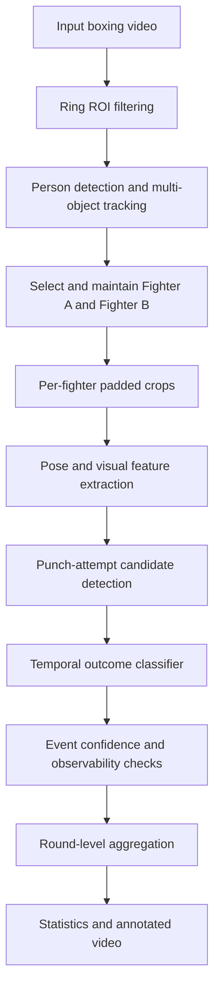

# Robust Landed-Punch Detection from Boxing Video

> **Status: early research prototype.** The repository currently contains an
> initial experiment with YOLO pose estimation. Fighter tracking, punch-event
> detection, outcome classification, and round-level statistics are planned but
> are not implemented yet.

## Overview

This project explores an event-based computer vision system for analysing a
boxing round from a single RGB video. The long-term objective is to identify
the two fighters, detect punch attempts, classify the outcome of each attempt,
and produce round-level statistics.

Target output:

```text
Round 1

Fighter A
  Punch attempts: 31
  Landed: 18

Fighter B
  Punch attempts: 27
  Landed: 14
```

The intended event labels are:

- `landed`: the punch makes visible contact with the opponent's head or body;
- `blocked`: the punch is stopped or redirected by the opponent's guard;
- `missed`: a punch attempt does not make contact;
- `no_punch`: ordinary hand movement, guard adjustment, or defensive motion;
- `unobservable`: the outcome cannot be inferred because the contact region is
  occluded or outside the frame.

The `unobservable` label is important. A model should not be forced to predict
an outcome when the video does not contain enough visual evidence.

## Scope of the first working version

The initial version intentionally uses a constrained setting:

- one continuous round per input video;
- one camera view with no replay or scene cuts;
- exactly two fighters;
- manual fighter selection on a clear frame;
- `blocked` and `parried` treated as one class;
- offline processing rather than real-time inference;
- output counts and timestamped punch events.

Automatic round detection, punch-type classification, judging, and reliable
operation across arbitrary broadcast footage are outside the initial scope.

## Why the task is difficult

Boxing footage contains several failure modes that make frame-level heuristics
unreliable:

- the referee, audience, and corner staff are also detected as people;
- fighters frequently overlap each other;
- the referee and ropes can hide the contact point;
- a fighter can leave the frame or become only partially visible;
- fast punches create motion blur;
- camera motion can cause tracker ID switches;
- standard COCO pose models predict wrists but not glove boundaries;
- landed, blocked, and near-miss punches may look similar in a single frame.

For these reasons, the planned system separates identity tracking, pose
extraction, temporal event detection, and outcome classification.

## Proposed system design



### 1. Ring-region filtering

A polygon representing the ring is defined once for the video. A person is
considered a ring participant only when the bottom-centre point of their
bounding box lies inside this polygon. This removes most spectators and corner
staff before pose processing.

### 2. Fighter selection and tracking

The user selects the two fighters on a clear frame. Their identities are then
maintained across the video with a multi-object tracker such as BoT-SORT.
Tracking should combine:

- bounding-box motion and overlap;
- appearance embeddings when available;
- clothing, headguard, and glove colour cues;
- the previously assigned fighter identity.

Other people may still be detected, but only the two selected fighter tracks
are passed to the downstream pipeline. This prevents a nearby referee from
being mistaken for a fighter simply because the referee has a larger or more
confident detection.

### 3. Per-fighter pose extraction

Pose inference is run on padded fighter crops rather than on the complete
frame. Cropping increases the effective resolution of the arms and upper body.

Every keypoint is stored together with its confidence. Low-confidence points
are masked rather than interpreted as real motion:

```text
high confidence     -> use the observed keypoint
short missing gap   -> interpolate with a maximum-gap constraint
long missing gap    -> keep as missing and set an occlusion flag
```

The temporal model must receive both features and a visibility mask so it can
distinguish actual movement from pose-estimation failure.

### 4. Punch-attempt detection

The first modelling task is binary event detection: `punch_attempt` versus
`no_punch`. Candidate features include:

- wrist velocity and acceleration;
- elbow extension;
- wrist-to-shoulder distance;
- motion direction relative to the opponent;
- distance from the attacking wrist to the opponent;
- return of the hand toward the guard position;
- keypoint visibility and track confidence.

A rule-based detector will serve as the baseline. A temporal classifier can
then operate on short windows of normalized keypoint sequences.

### 5. Outcome classification

Each detected attempt produces a short clip containing frames before, during,
and after the candidate contact. The outcome classifier uses temporal evidence
instead of a single frame.

Potential signals include:

- glove trajectory toward the opponent's head or torso;
- minimum glove-to-target distance;
- intersection with the defending gloves or forearms;
- opponent head or torso displacement after potential contact;
- optical flow around the candidate contact region;
- keypoint and detection confidence;
- duration and degree of occlusion.

A future custom detector may add explicit `glove`, `head`, and `torso` regions,
because generic human-pose keypoints alone do not describe glove contact.

## Event annotation format

Annotations should be stored at event level and split by fight, not by random
frames. A proposed JSON record is:

```json
{
  "video_id": "fight_001",
  "round": 1,
  "attacker": "fighter_a",
  "start_frame": 418,
  "contact_frame": 426,
  "end_frame": 437,
  "outcome": "blocked",
  "observable": true,
  "notes": "Punch stopped by opponent's lead glove"
}
```

Recommended annotation rules:

- mark the complete attempt from initiation to guard recovery;
- assign an outcome only when the relevant contact region is visible;
- use `unobservable` for severe occlusion or off-screen contact;
- keep ambiguous examples for later review rather than guessing;
- ensure that train, validation, and test sets contain different fights.

Splitting by fight prevents leakage through repeated backgrounds, camera
positions, clothing, and fighter appearance.

## Evaluation

Frame accuracy is not an appropriate primary metric because most frames contain
no punch. Evaluation should be performed at event level.

Planned metrics:

### Punch-attempt detection

- event-level precision, recall, and F1;
- temporal matching tolerance or temporal IoU;
- false attempts per minute;
- mean absolute error of attempt counts per round.

### Outcome classification

- macro-F1 across `landed`, `blocked`, and `missed`;
- per-class precision and recall;
- confusion matrix;
- landed-count mean absolute error per round;
- coverage: percentage of events classified rather than marked unobservable.

### System performance

- processing time per video minute;
- inference latency per frame;
- tracker ID switches;
- percentage of frames with usable keypoints for both fighters.

Metrics will be reported only after a labelled test set and reproducible
evaluation pipeline are available.

## Current repository contents

```text
Boxing-fight-analysis/
├── models/                 # Local pose-model weights
├── posefiltering.ipynb     # Initial YOLO pose exploration
├── .gitignore
├── LICENSE
└── README.md
```

The current notebook loads a YOLO pose model. The architecture described above
is the implementation roadmap, not a claim that the complete pipeline already
exists.

## Local setup

Python 3.10 or newer is recommended.

```bash
python -m venv .venv
source .venv/bin/activate
python -m pip install --upgrade pip
python -m pip install ultralytics opencv-python jupyter
jupyter notebook posefiltering.ipynb
```

Model weights can be downloaded automatically by Ultralytics when a supported
model name is used. Large weights, raw videos, generated predictions, and
private datasets should not be committed directly to Git.

## Planned project structure

```text
Boxing-fight-analysis/
├── configs/
│   ├── tracking.yaml
│   └── inference.yaml
├── data/
│   ├── annotations/
│   └── samples/
├── notebooks/
│   └── pose_baseline.ipynb
├── src/boxing_analysis/
│   ├── detection.py
│   ├── tracking.py
│   ├── pose.py
│   ├── features.py
│   ├── events.py
│   ├── outcomes.py
│   └── aggregation.py
├── tests/
├── scripts/
│   ├── extract_features.py
│   ├── run_inference.py
│   └── evaluate.py
├── requirements.txt
└── README.md
```

## Roadmap

- [x] Load a pretrained YOLO pose model.
- [x] Inspect multi-person pose predictions on boxing footage.
- [ ] Define a ring polygon and remove out-of-ring detections.
- [ ] Add manual initialization for Fighter A and Fighter B.
- [ ] Track both fighters with persistent identities.
- [ ] Run pose inference on individual padded fighter crops.
- [ ] Store confidence-aware keypoint sequences.
- [ ] Implement a rule-based punch-attempt baseline.
- [ ] Create and document an event-labelled dataset.
- [ ] Train and evaluate a temporal punch-attempt model.
- [ ] Train the punch-outcome classifier.
- [ ] Add uncertainty and `unobservable` handling.
- [ ] Generate round statistics and an annotated output video.
- [ ] Add automated tests and a reproducible evaluation command.

## Known limitations

- Severe occlusion can make the punch outcome visually unknowable.
- A single camera does not provide depth or force measurements.
- Broadcast cuts and replays require a separate shot-detection stage.
- Generic pose models may fail on gloves, unusual stances, and motion blur.
- Results may not generalize across venues, camera angles, weight classes, or
  protective equipment without a sufficiently diverse dataset.
- Predicted landed-punch counts are analytical estimates and should not be
  treated as official judging statistics.

## Data and ethics

Only footage that can be used legally should be included in the dataset. Raw
copyrighted fight videos should not be redistributed through this repository.
Any public sample should be appropriately licensed, attributed, or replaced by
a short recording created specifically for demonstration.

## License

The source code is released under the [MIT License](LICENSE). This license does
not grant rights to third-party fight footage, model weights, or datasets.
